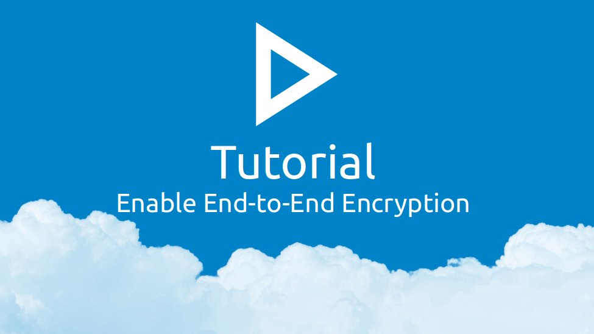

The passwords app offers strong end-to-end encryption which requires anyone trying to decrypt your passwords to know the encryption passphrase.

#### Before you start
- By default, the encryption setup will encrypt all existing passwords, folders and tags except those who are shared.
- All previous revisions but the current will be deleted.
- The encryption setup will also create a new password entry with your encryption passphrase.
  If you do not want this, switch the settings view to `Advanced` in the top right corner and uncheck the options in step 5 of the setup.
- The encryption setup will create the new entries before deleting any old ones.
  So even if something goes wrong, there should be no data loss.

#### Enabling End-to-End encryption
1. Open the Settings (`More > Settings`)
2. Locate the `Encryption` section at the end of the `Security` section.
3. Click the `Activate` button next to `End-to-End Encryption`.
4. The setup wizard will appear. Click continue to see the encryption passphrase dialog.
5. Choose an encryption passphrase with at least 12 characters and confirm it.
   > :warning: Do not use your Nextcloud password.
   > Every Nextcloud app can read your Nextcloud password and it offers no security
6. Click `Save`.

The encryption setup will automatically encrypt all folders and passwords

> :warning: Do not abort the encryption process or reload the page