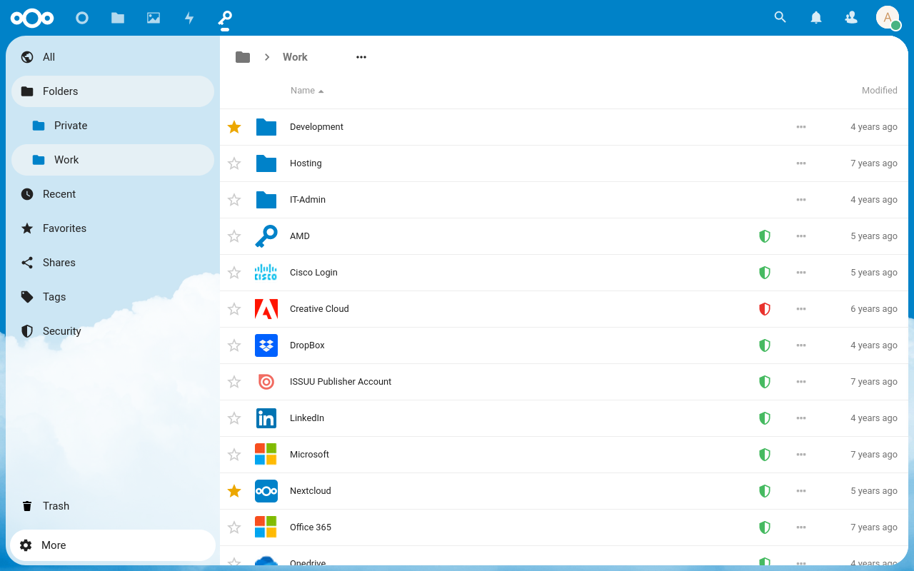

Folders are a great way to organize passwords.
A well structured folder hierarchy makes the application faster and passwords easier to find.
For example you could have a folder "Work" for accounts related to your workplace and a folder "Private" for your own passwords.
A password can only be in one folder at a time.
If you want to classify passwords with multiple keywords, consider using [tags](./Tags).

## Folders in the list view

To open a folder, click on it on the list view.
To move passwords or folders into a folder, drag and drop them onto the folder.
To move passwords or folders into the parent folder, drop them onto the folder in the navigation.

##### The `⋯`-Menu
With the `More` menu, you can access all other options available for the folder.
The `Rename` option will open the `Rename Folder` window where you can change the name.
The `Delete` option will move the folder and its contents to the trash.

## Creating a folder

Click on the `+`-Button in the breadcrumb navigation in the folder section and select `New Folder` to open the folder creation dialog.
Enter the name of the folder and click on `Yes` to create the folder.

**Notes**
- The folder will always be created in the current folder.
- Folder are not unique. Different folders with the same name can exist.

## Deleting folders
Once you select the `Delete` option from the `⋯`-Menu, the folder and all its contents will be moved into the trash.
You can still browse the folder there and restore it if needed.

**Note:** Deleting a folder from the trash will delete the folder and all passwords and folders in it.